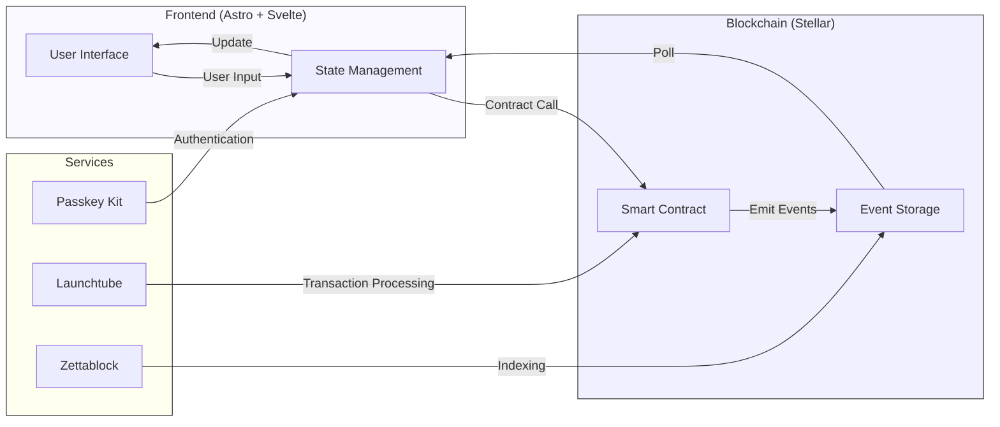
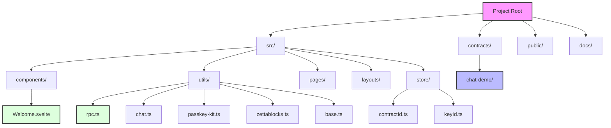
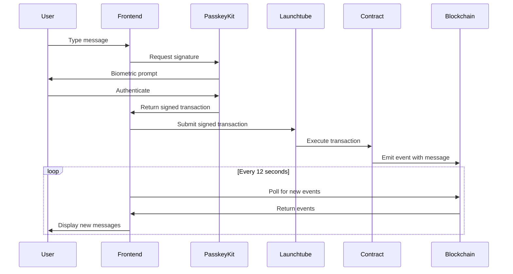

# Architecture

This document details the architecture of the Stellar Network Chat Demo, explaining how the different components interact to create a cohesive application.

## System Architecture

The application follows a modern blockchain architecture pattern with clear separation of concerns:



## Technical Stack

| Layer | Technology | Description |
|-------|------------|-------------|
| **Blockchain** | Stellar (Soroban) | Smart contract platform |
| **Frontend Framework** | Astro | Web framework for content-focused websites |
| **UI Library** | Svelte | Reactive UI component framework |
| **Authentication** | PasskeyKit | WebAuthn-based authentication library |
| **Transaction Management** | Launchtube | Stellar transaction submission service |
| **Event Indexing** | Zettablock | Blockchain data indexing service |
| **Styling** | Tailwind CSS | Utility-first CSS framework |

## Directory Structure



## Component Architecture

### Frontend Components

```mermaid
componentDiagram
    component Frontend {
        component Components {
            [Welcome.svelte]
        }
        component Utils {
            [chat.ts]
            [passkey-kit.ts]
            [rpc.ts]
            [zettablocks.ts]
        }
        component Store {
            [contractId.ts]
            [keyId.ts]
        }
    }
    
    [Welcome.svelte] --> [chat.ts]
    [Welcome.svelte] --> [passkey-kit.ts]
    [Welcome.svelte] --> [rpc.ts]
    [Welcome.svelte] --> [contractId.ts]
    [Welcome.svelte] --> [keyId.ts]
    [Welcome.svelte] --> [zettablocks.ts]
```

### Data Flow

The sequence of operations when sending and receiving messages:



## Key Design Decisions

### Event-Based Data Storage

Rather than storing message data directly in contract storage, we use events for data persistence. This approach:

- Reduces storage costs
- Simplifies contract logic
- Enables easy event indexing and querying
- Provides an immutable history of messages

### Authentication with Passkeys

We use PasskeyKit for authentication because:

- It's more secure than password-based authentication
- It provides a familiar user experience
- It can handle transaction signing
- It's compatible with modern browsers and devices

### Polling for Events

The application polls for new events every 12 seconds because:

- It provides near real-time updates
- It's more efficient than WebSocket connections for this use case
- It's simple to implement
- It's compatible with all browsers

### XDR Format for Event Data

Stellar uses XDR (External Data Representation) format for structured data:

- Binary format for efficient data transfer
- Platform-independent serialization
- Strongly typed data structures
- Consistent across different programming languages

## Integration Points

| Integration | Purpose | Integration Method |
|-------------|---------|-------------------|
| Stellar RPC | Contract interaction | HTTP/JSON-RPC |
| PasskeyKit | Authentication | JavaScript SDK |
| Launchtube | Transaction management | HTTP API |
| Zettablock | Event indexing | HTTP API |
``` 