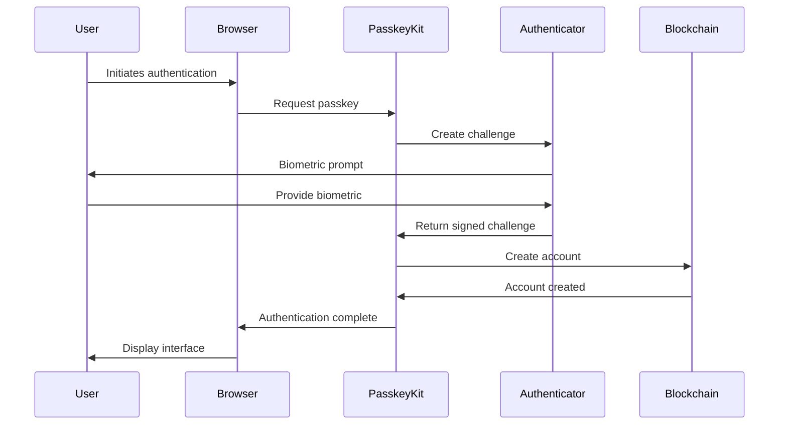
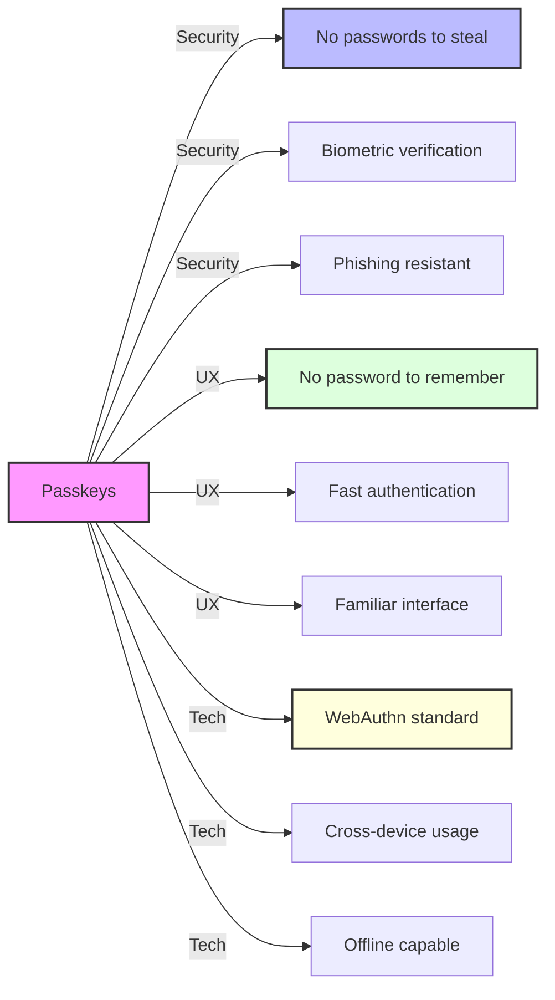
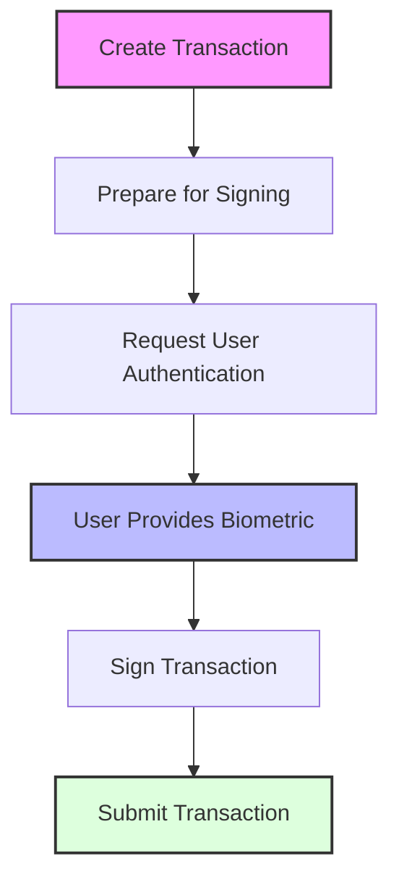

# Authentication

This project uses [PasskeyKit](https://github.com/kalepail/passkey-kit) to provide secure, passwordless authentication through WebAuthn.

## Passkey Authentication Flow



## Benefits of Passkeys



### Security Benefits

- **No Password Vulnerabilities**: Eliminates password-related risks like dictionary attacks, credential stuffing, and phishing
- **Biometric Verification**: Uses fingerprints, facial recognition, or other biometrics for authentication
- **Strong Cryptography**: Based on public key cryptography
- **Hardware-Backed**: Often stored in secure hardware elements
- **Phishing Resistant**: Credentials are tied to specific origins

### User Experience Benefits

- **Passwordless**: No passwords to remember or reset
- **Familiar Interface**: Uses device biometrics users already trust
- **Cross-Device**: Can work across multiple devices
- **Fast Authentication**: Quick to authenticate compared to typing passwords

## PasskeyKit Integration

### Frontend Configuration

The project integrates PasskeyKit in `src/utils/passkey-kit.ts`:

```typescript
import { PasskeyKit, PasskeyAccount, PasskeyServer } from "passkey-kit";

export const passkit = new PasskeyKit({
    rpcUrl: import.meta.env.PUBLIC_RPC_URL,
    networkPassphrase: import.meta.env.PUBLIC_NETWORK_PASSPHRASE,
});

export const account = new PasskeyAccount({
    rpcUrl: import.meta.env.PUBLIC_RPC_URL,
    networkPassphrase: import.meta.env.PUBLIC_NETWORK_PASSPHRASE,
});

export const server = new PasskeyServer({
    rpcUrl: import.meta.env.PUBLIC_RPC_URL,
    launchtubeUrl: import.meta.env.PUBLIC_LAUNCHTUBE_URL,
    launchtubeJwt: import.meta.env.PUBLIC_LAUNCHTUBE_JWT,
});
```

### Authentication Process

1. **Registration**:
   - User initiates registration
   - Browser creates a new key pair
   - PasskeyKit creates a Stellar account using the public key
   - Private key remains in browser's secure storage

2. **Login**:
   - User initiates login
   - PasskeyKit requests a credential from the browser
   - Browser presents authentication options (fingerprint, face ID, etc.)
   - User authenticates
   - PasskeyKit verifies the credential and retrieves the Stellar account

3. **Transaction Signing**:
   - App creates a transaction
   - PasskeyKit requests a signature from the browser
   - User authenticates with biometrics
   - Browser signs the transaction with the private key
   - Signed transaction is submitted to the blockchain

## Signing Flow



In the chat application, signing occurs when a user sends a message:

```typescript
async function send() {
    // Create transaction
    let at = await chat.send({
        addr: $contractId,
        msg,
    });
    
    // Sign transaction with passkey
    at = await account.sign(at, {keyId: $keyId});

    // Submit transaction
    await server.send(at);
}
```

## WebAuthn Standards

PasskeyKit is built on the [WebAuthn (Web Authentication)](https://www.w3.org/TR/webauthn-2/) standard, which:

- Is a W3C standard for passwordless authentication
- Supports a wide range of authenticators (fingerprint sensors, security keys, etc.)
- Is supported by all major browsers
- Provides strong security guarantees

## Implementation Details

### Authentication State Management

The application stores authentication state using Svelte stores:

```typescript
// src/store/keyId.ts
import { browser } from "$app/environment";
import { writable } from "svelte/store";

const STORAGE_KEY = "chat_key_id";

const storedKeyId = browser && localStorage.getItem(STORAGE_KEY);

export const keyId = writable<string | undefined>(storedKeyId || undefined);

keyId.subscribe((value) => {
    if (browser && value) {
        localStorage.setItem(STORAGE_KEY, value);
    } else if (browser && !value) {
        localStorage.removeItem(STORAGE_KEY);
    }
});
```

### Contract ID State Management

Similarly, the contract ID is managed through a Svelte store:

```typescript
// src/store/contractId.ts
import { browser } from "$app/environment";
import { writable } from "svelte/store";

const STORAGE_KEY = "chat_contract_id";

const storedContractId = browser && localStorage.getItem(STORAGE_KEY);
const defaultContractId = import.meta.env.PUBLIC_CHAT_CONTRACT_ID;

export const contractId = writable<string>(
    storedContractId || defaultContractId
);

contractId.subscribe((value) => {
    if (browser && value) {
        localStorage.setItem(STORAGE_KEY, value);
    } else if (browser && !value) {
        localStorage.removeItem(STORAGE_KEY);
    }
});
```

## Security Considerations

- **Origin Binding**: Passkeys are bound to specific origins, preventing phishing
- **No Shared Secrets**: No shared secrets between client and server
- **Secure Storage**: Private keys are stored in the browser's secure storage
- **No Server-Side Storage**: Private keys never leave the device
- **Mandate Authentication**: The smart contract enforces authentication for all message sends

## Compatibility

PasskeyKit works with:

- **Browsers**: Chrome, Safari, Firefox, Edge
- **Platforms**: Windows, macOS, iOS, Android
- **Authenticators**: Built-in biometrics, security keys, password managers

## Future Enhancements

- **Recovery Options**: Implement account recovery mechanisms
- **Policy Controls**: Add fine-grained transaction authorization policies
- **Multi-Device Support**: Improve support for using passkeys across multiple devices
- **Transaction Analysis**: Add transaction analysis to prevent malicious transactions 