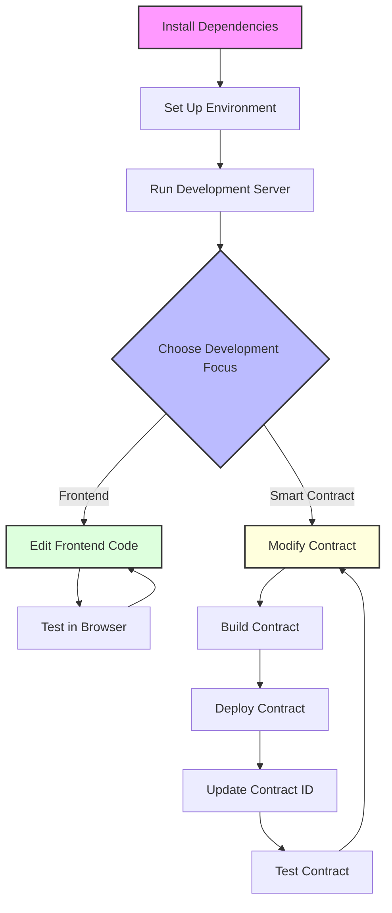
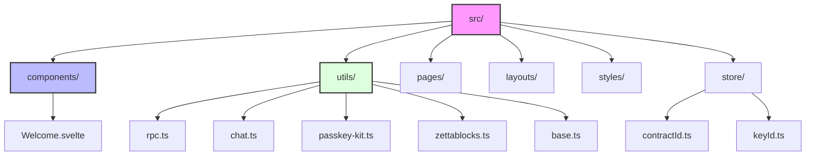

# Development Guide

This guide provides instructions for setting up, developing, and extending the Stellar Chat Demo.

## Prerequisites

Before you begin, ensure you have the following installed:

- [Node.js](https://nodejs.org/) (v18 or later)
- [PNPM](https://pnpm.io/) (v8 or later)
- [Rust](https://www.rust-lang.org/tools/install) (for smart contract development)
- [Stellar CLI](https://developers.stellar.org/docs/tools/cli/install-cli)

## Project Setup

1. Clone the repository:

```bash
git clone https://github.com/jaffarkeikei/smart-stellar-demo.git
cd smart-stellar-demo
```

2. Install dependencies:

```bash
pnpm install
```

3. Set up your environment variables by creating a `.env` file in the root directory:

```
PUBLIC_RPC_URL=https://testnet.rpciege.com/
PUBLIC_NETWORK_PASSPHRASE="Test SDF Network ; September 2015;"
PUBLIC_CHAT_CONTRACT_ID=CBUMOJAEAPLQUCWVIM6HJH5XKXW5OP7CRVOOYMJYSTZ6GFDNA72O2QW6
PUBLIC_LAUNCHTUBE_URL=https://launchtube.stellar.org
PUBLIC_LAUNCHTUBE_JWT=your_launchtube_jwt
PUBLIC_ZETTABLOCK_API_KEY=your_zettablock_api_key
```

4. Start the development server:

```bash
pnpm run dev
```

## Development Workflow



## Smart Contract Development

### Building the Contract

1. Navigate to the contract directory:

```bash
cd contracts/chat-demo
```

2. Build the contract using the Stellar CLI:

```bash
stellar contract build
```

This will create a WebAssembly (WASM) file in the `target/wasm32-unknown-unknown/release/` directory.

### Deploying the Contract

Deploy the contract to the Stellar testnet:

```bash
stellar contract deploy \
    --wasm target/wasm32-unknown-unknown/release/chat_demo.wasm \
    --source your_account_name \
    --network testnet
```

This will output a contract ID. Update your `.env` file with this new contract ID:

```
PUBLIC_CHAT_CONTRACT_ID=your_new_contract_id
```

### Generating TypeScript Bindings

Generate TypeScript bindings for your contract:

```bash
stellar contract bindings typescript \
    --wasm target/wasm32-unknown-unknown/release/chat_demo.wasm \
    --output ../chat-demo-sdk
```

### Testing the Contract

You can test the contract using the Stellar CLI:

```bash
stellar contract invoke \
    --id your_contract_id \
    --source your_account_name \
    --network testnet \
    -- \
    send \
    --addr your_address \
    --msg "Test message"
```

## Frontend Development

### Project Structure



### Adding New Components

To add a new component:

1. Create a new file in the `src/components` directory:

```
touch src/components/NewComponent.svelte
```

2. Implement your component:

```svelte
<script lang="ts">
    // Component logic here
</script>

<div>
    <!-- Component template here -->
</div>

<style>
    /* Component styles here */
</style>
```

3. Import and use your component:

```svelte
<script lang="ts">
    import NewComponent from '../components/NewComponent.svelte';
</script>

<NewComponent />
```

### Styling with Tailwind CSS

The project uses Tailwind CSS for styling. You can add Tailwind classes directly to your HTML elements:

```html
<div class="flex flex-col p-4 bg-gray-100 rounded-lg shadow-md">
    <h1 class="text-2xl font-bold text-gray-800">Hello World</h1>
    <p class="mt-2 text-gray-600">Welcome to the Stellar Chat Demo</p>
</div>
```

## Authentication Integration

### Using PasskeyKit

To integrate PasskeyKit authentication:

1. Import the required components:

```typescript
import { passkit, account, server } from "../utils/passkey-kit";
```

2. Create a user registration function:

```typescript
async function register() {
    try {
        const { id } = await passkit.register();
        keyId.set(id);
    } catch (error) {
        console.error(error);
    }
}
```

3. Create a user login function:

```typescript
async function login() {
    try {
        const { id } = await passkit.login();
        keyId.set(id);
    } catch (error) {
        console.error(error);
    }
}
```

## Event Handling

### Retrieving Events

To retrieve events from the blockchain:

```typescript
import { getEvents, rpc } from "../utils/rpc";

async function fetchEvents() {
    const { sequence } = await rpc.getLatestLedger();
    const events = await getEvents([], sequence - 17_280); // last 24 hrs
    console.log(events);
}
```

### Processing Events

Process events into a usable format:

```typescript
events.forEach((event) => {
    if (event.type !== "contract" || !event.contractId) return;

    // Process event
    const message = {
        id: event.id,
        sender: event.topic[0].address(),
        content: event.value,
        timestamp: new Date(event.ledgerClosedAt)
    };
    
    // Add to messages array
    messages.push(message);
});
```

## Building for Production

To build the application for production:

```bash
pnpm run build
```

This will generate a production-ready build in the `dist` directory.

## Deployment

### Deploying to Cloudflare Pages

1. Configure your Cloudflare Pages project:

```bash
pnpm astro add cloudflare
```

2. Update your `astro.config.mjs` file:

```javascript
import { defineConfig } from 'astro/config';
import svelte from '@astrojs/svelte';
import cloudflare from '@astrojs/cloudflare';

export default defineConfig({
  integrations: [svelte()],
  output: 'server',
  adapter: cloudflare()
});
```

3. Deploy to Cloudflare Pages:

```bash
pnpm run build
npx wrangler pages publish dist
```

## Best Practices

### Smart Contract Development

- Keep contracts simple and focused
- Use events for data storage when appropriate
- Include comprehensive tests
- Follow the principle of least privilege
- Use `require_auth()` for all user-initiated actions

### Frontend Development

- Use TypeScript for type safety
- Follow the component-based architecture
- Keep components small and focused
- Use Svelte stores for state management
- Implement proper error handling
- Follow accessibility best practices

### Authentication

- Always validate user input
- Never store private keys on the server
- Use biometric authentication when available
- Implement proper error handling for authentication failures
- Consider recovery options for lost passkeys

## Common Issues and Solutions

### Contract Deployment Errors

If you encounter errors when deploying your contract:

- Ensure you have the correct account configured
- Check that your account has sufficient funds
- Verify that the WASM file path is correct
- Check for any syntax errors in your Rust code

### Frontend Development Issues

Common frontend issues:

- **TypeScript Errors**: Ensure your types are correctly defined
- **Component Rendering Issues**: Check for reactivity issues in Svelte
- **Authentication Errors**: Verify your PasskeyKit configuration
- **RPC Errors**: Check your RPC URL and network passphrase

## Resources

- [Stellar Developers Documentation](https://developers.stellar.org/)
- [Soroban Smart Contracts Documentation](https://developers.stellar.org/docs/build/smart-contracts/getting-started)
- [Svelte Documentation](https://svelte.dev/docs)
- [Astro Documentation](https://docs.astro.build/)
- [Tailwind CSS Documentation](https://tailwindcss.com/docs)
- [PasskeyKit Documentation](https://github.com/kalepail/passkey-kit)
- [Stellar Discord Server](https://discord.gg/stellardev) 