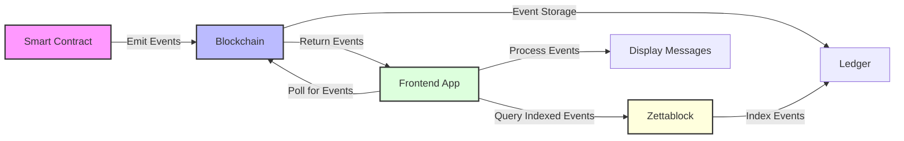
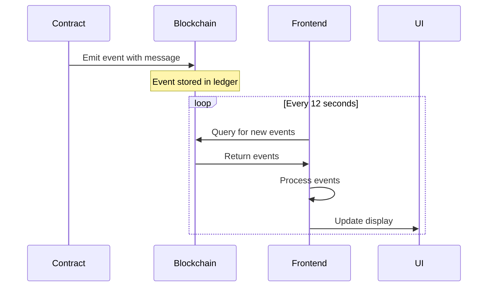
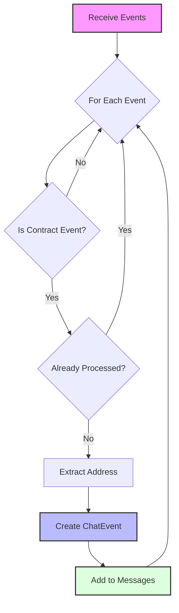

# Event Handling

This document explains how the Stellar Chat Demo handles blockchain events for real-time message display.

## Event Architecture



## Event Flow



## Event Formats

### XDR Format (Binary)

Events are stored on the blockchain in XDR (External Data Representation) format, which is a compact binary format:

```
AAAAAQAAAAAAAAABaMckBAPXCgrVQzx0n7dV7dc/4o1c7DE4lPPjFG0H9O0AAAABAAAAAAAAAAEAAAASAAAAAAAAAADElgmYaPOi19RkiYiykhX7tQjaBZ4Sw1wgNFLgIiDYUQAAAA4AAAAQdGVzdC1tc2ctdG8tc2VuZA==
```

### JSON Format (Decoded)

When decoded, the event looks like this:

```json
{
  "in_successful_contract_call": true,
  "event": {
    "ext": "v0",
    "contract_id": "68c7240403d70a0ad5433c749fb755edd73fe28d5cec313894f3e3146d07f4ed",
    "type_": "contract",
    "body": {
      "v0": {
        "topics": [
          {
            "address": "GDCJMCMYNDZ2FV6UMSEYRMUSCX53KCG2AWPBFQ24EA2FFYBCEDMFCBCV"
          }
        ],
        "data": {
          "string": "test-msg-to-send"
        }
      }
    }
  }
}
```

### ChatEvent Interface

For use in the frontend, events are processed into a structured `ChatEvent` interface:

```typescript
interface ChatEvent {
    id: string;           // Event ID
    addr: string;         // Sender address
    timestamp: Date;      // Message timestamp
    txHash: string;       // Transaction hash
    msg: string;          // Message content
}
```

## Polling Mechanism

The application uses polling to retrieve new events from the blockchain. This approach was chosen for its simplicity and compatibility with all browsers.

```typescript
// src/components/Welcome.svelte
onMount(async () => {
    await callGetMessages();

    const { sequence } = await rpc.getLatestLedger();
    await callGetEvents(sequence - 17_280); // last 24 hrs

    interval = setInterval(async () => {
        const { sequence } = await rpc.getLatestLedger();
        await callGetEvents(sequence - 17_280); // last 24 hrs
    }, 12_000); // 5 times per minute
});
```

## Event Retrieval

### Using RPC Server

Events are retrieved using the Stellar RPC Server from the JavaScript SDK:

```typescript
// src/utils/rpc.ts
export const rpc = new Server(
    import.meta.env.PUBLIC_RPC_URL,
    import.meta.env.PUBLIC_NETWORK_PASSPHRASE
);

export async function getEvents(
    msgs: ChatEvent[] = [],
    limit: number | string = 0,
    found = false
): Promise<ChatEvent[]> {
    try {
        const { events } = await rpc.getEvents({
            filters: [
                {
                    type: "contract",
                    contractIds: [import.meta.env.PUBLIC_CHAT_CONTRACT_ID],
                },
            ],
            startLedger: typeof limit === "number" ? limit : undefined,
            limit: 10_000,
            cursor: typeof limit === "string" ? limit : undefined,
        });
        
        // Process events...
    } catch (error) {
        console.error(error);
    }
    
    return msgs;
}
```

### Event Processing



The code processes events into `ChatEvent` objects:

```typescript
// Process events
events.forEach((event) => {
    if (event.type !== "contract" || !event.contractId) return;

    if (msgs.findIndex(({id}) => id === event.id) === -1) {
        let addr: string | undefined;
        let topic0 = event.topic[0].address();

        switch (topic0.switch().name) {
            case "scAddressTypeAccount": {
                addr = Address.account(
                    topic0.accountId().ed25519(),
                ).toString();
                break;
            }
            case "scAddressTypeContract": {
                addr = Address.contract(
                    topic0.contractId(),
                ).toString();
                break;
            }
        }

        msgs.push({
            id: event.id,
            addr,
            timestamp: new Date(event.ledgerClosedAt),
            txHash: event.txHash,
            msg: scValToNative(event.value),
        });
    }
});
```

## Zettablock Integration

In addition to direct RPC polling, the application also uses Zettablock for indexed event retrieval:

```typescript
// src/utils/zettablocks.ts
export async function getMessages(): Promise<ChatEvent[]> {
    try {
        const response = await fetch(
            "https://api.zettablock.com/graphql",
            {
                method: "POST",
                headers: {
                    "Content-Type": "application/json",
                    "X-API-KEY": import.meta.env.PUBLIC_ZETTABLOCK_API_KEY,
                },
                body: JSON.stringify({
                    query: `
                        query GetMessages {
                            stellar_testnet {
                                soroban_events(
                                    where: {
                                        contract_id: {_eq: "${import.meta.env.PUBLIC_CHAT_CONTRACT_ID}"}
                                    }
                                    order_by: {ledger_timestamp: asc}
                                ) {
                                    id
                                    tx_hash
                                    topic_0
                                    value
                                    ledger_timestamp
                                }
                            }
                        }
                    `,
                }),
            }
        );

        // Process response...
    } catch (error) {
        console.error(error);
        return [];
    }

    return [];
}
```

## Displaying Events

Once events are processed, they are displayed in the UI using Svelte's reactive model:

```html
<!-- src/components/Welcome.svelte -->
<ul>
    {#each msgs as event}
        <li class="mb-2">
            <span class="text-mono text-sm bg-black rounded-t-lg text-white px-3 py-1">
                <a class="underline" target="_blank" href="https://stellar.expert/explorer/public/tx/{event.txHash}">
                    {truncate(event.addr, 4)}
                </a>
                &nbsp; &nbsp;
                <time class="text-xs text-gray-400" datetime={event.timestamp.toUTCString()}>
                    {event.timestamp.toLocaleTimeString()}
                </time>
            </span>
            <p class="min-w-[220px] text-pretty break-words bg-gray-200 px-3 py-1 rounded-b-lg rounded-tr-lg border border-gray-400">
                {event.msg}
            </p>
        </li>
    {/each}
</ul>
```

## Event Filtering and Sorting

Events are sorted by timestamp to display messages in chronological order:

```typescript
// src/components/Welcome.svelte
async function callGetEvents(
    limit: number | string,
    found: boolean = false,
) {
    msgs = await getEvents(msgs, limit, found);
    msgs = msgs.sort(
        (a, b) => a.timestamp.getTime() - b.timestamp.getTime(),
    );
}
```

## Event Pagination

Events can be paginated using two methods:

### Using a Cursor

```typescript
await rpc.getEvents({
    // ...
    cursor: "0002533961985163263-4294967295",
});
```

### Using a Start Ledger

```typescript
await rpc.getEvents({
    // ...
    startLedger: 589386,
});
```

## Alternative Event Indexers

While this project primarily uses Zettablock, there are other indexers that could be used:

- [Subquery](https://subquery.network/)
- [Goldsky](https://goldsky.com/)

## Future Enhancements

Potential improvements to event handling:

- **Real-time Updates**: Implement WebSocket connections for real-time message updates
- **Advanced Filtering**: Add support for filtering messages by sender or content
- **Message Search**: Implement full-text search of message content
- **Pagination UI**: Add UI controls for paginating through historical messages
- **Offline Support**: Implement caching for offline message viewing 