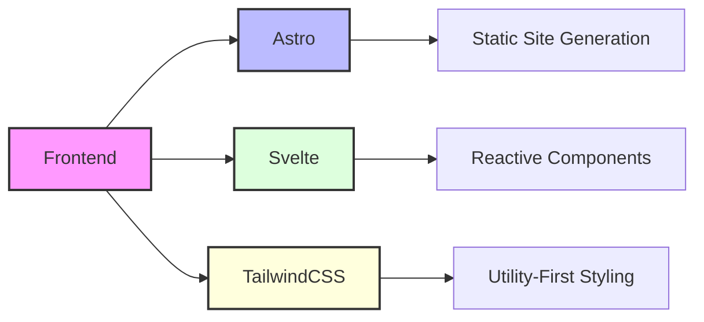
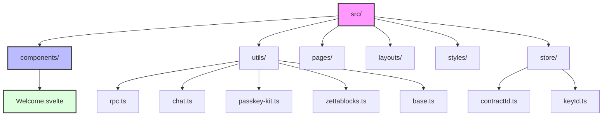
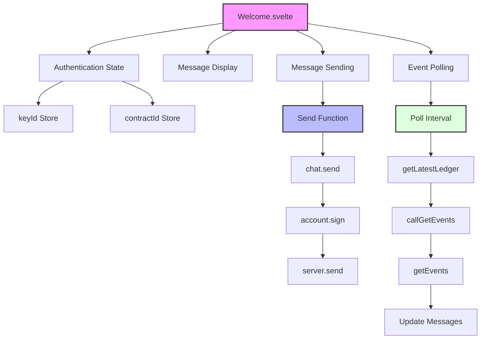
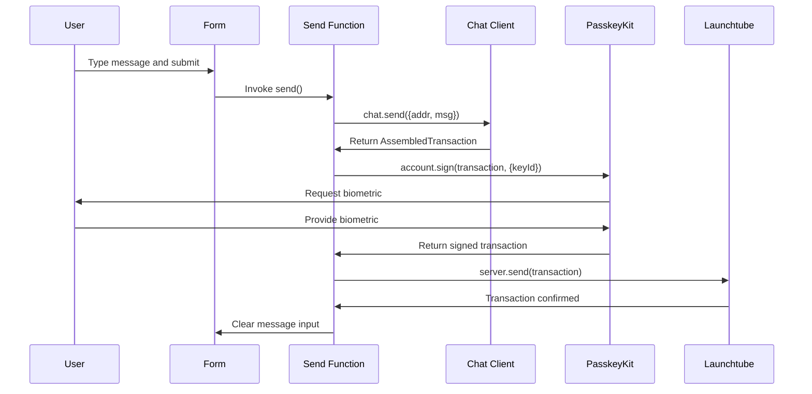
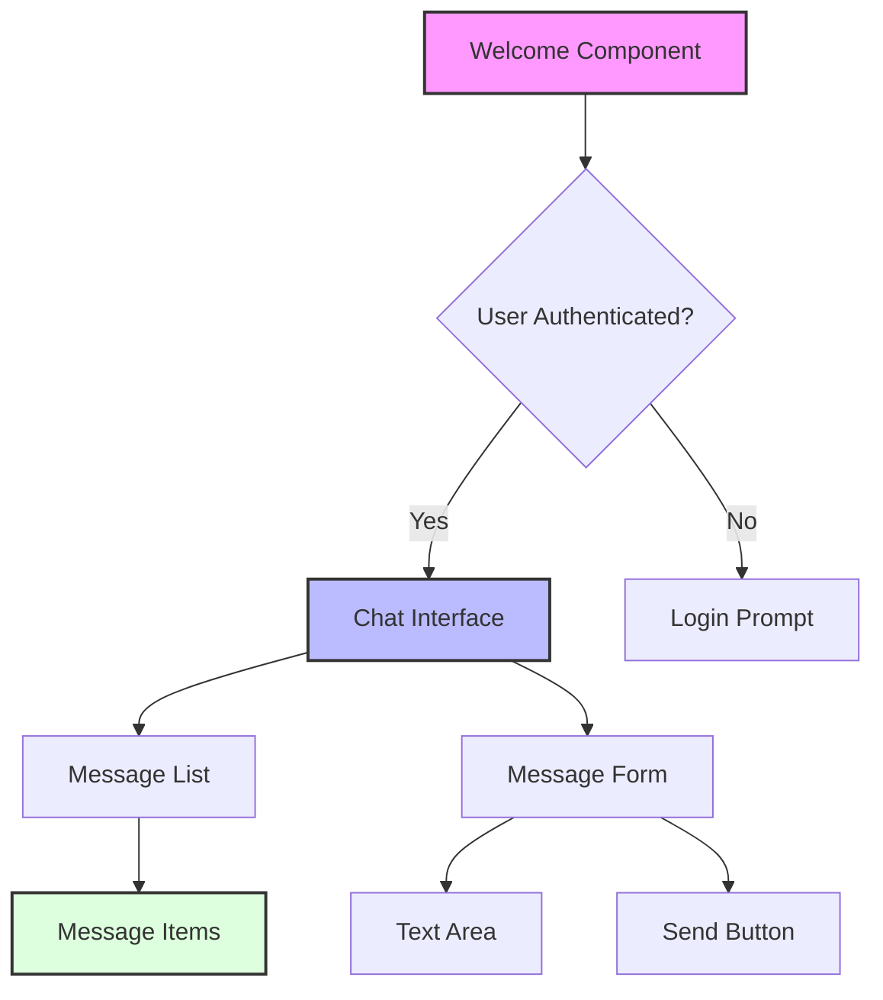
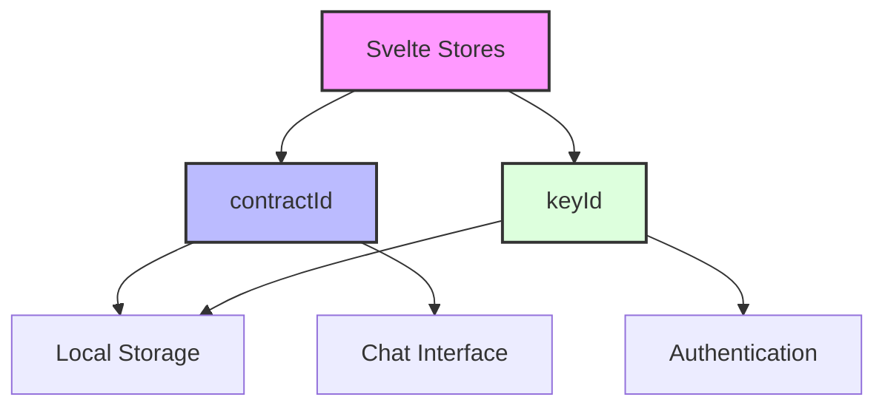

# Frontend Implementation

The Stellar Chat Demo uses a modern frontend stack with Astro and Svelte to create a responsive and performant user interface.

## Technology Stack



## Project Structure



## Main Component: Welcome.svelte

The main component of the application is `Welcome.svelte`, which handles:

- User authentication state
- Message display
- Message sending
- Event polling



## Component Lifecycle

```typescript
// src/components/Welcome.svelte
onMount(async () => {
    await callGetMessages();

    const { sequence } = await rpc.getLatestLedger();
    await callGetEvents(sequence - 17_280); // last 24 hrs

    interval = setInterval(async () => {
        const { sequence } = await rpc.getLatestLedger();
        await callGetEvents(sequence - 17_280); // last 24 hrs
    }, 12_000); // 5 times per minute
});

onDestroy(() => {
    if (interval) clearInterval(interval);
});
```

The component:
1. Initializes by fetching historical messages from Zettablock
2. Fetches recent events (last 24 hours) from the blockchain
3. Sets up a polling interval to check for new events every 12 seconds
4. Cleans up the interval when the component is destroyed

## Message Sending Flow



```typescript
// src/components/Welcome.svelte
async function send() {
    if (!$contractId || !$keyId) return;

    try {
        sending = true;

        let at = await chat.send({
            addr: $contractId,
            msg,
        });

        at = await account.sign(at, { keyId: $keyId });

        await server.send(at);

        msg = "";
    } finally {
        sending = false;
    }
}
```

## UI Structure

The UI is structured as a simple chat interface:



```html
<!-- src/components/Welcome.svelte -->
<div class="flex flex-col min-w-full items-center my-10">
    {#if $contractId}
        <div class="max-w-[350px] w-full">
            <!-- Message List -->
            <ul>
                {#each msgs as event}
                    <li class="mb-2">
                        <!-- Message display -->
                    </li>
                {/each}
            </ul>

            <!-- Message Form -->
            <form class="flex flex-col mt-5" on:submit|preventDefault={send}>
                <textarea
                    class="border px-3 py-1 mb-2 border-gray-400 rounded-lg"
                    rows="4"
                    name="msg"
                    id="msg"
                    placeholder="Type your message..."
                    bind:value={msg}
                ></textarea>

                <div class="flex items-center ml-auto">
                    <button
                        class="bg-black text-white px-2 py-1 text-sm font-mono disabled:bg-gray-400"
                        type="submit"
                        disabled={sending}>Send{sending ? "ing..." : ""}</button
                    >
                </div>
            </form>
        </div>
    {:else}
        <h1>Login or create a new account</h1>
    {/if}
</div>
```

## State Management

The application uses Svelte stores for state management:



### Contract ID Store

```typescript
// src/store/contractId.ts
import { browser } from "$app/environment";
import { writable } from "svelte/store";

const STORAGE_KEY = "chat_contract_id";

const storedContractId = browser && localStorage.getItem(STORAGE_KEY);
const defaultContractId = import.meta.env.PUBLIC_CHAT_CONTRACT_ID;

export const contractId = writable<string>(
    storedContractId || defaultContractId
);

contractId.subscribe((value) => {
    if (browser && value) {
        localStorage.setItem(STORAGE_KEY, value);
    } else if (browser && !value) {
        localStorage.removeItem(STORAGE_KEY);
    }
});
```

### Key ID Store

```typescript
// src/store/keyId.ts
import { browser } from "$app/environment";
import { writable } from "svelte/store";

const STORAGE_KEY = "chat_key_id";

const storedKeyId = browser && localStorage.getItem(STORAGE_KEY);

export const keyId = writable<string | undefined>(storedKeyId || undefined);

keyId.subscribe((value) => {
    if (browser && value) {
        localStorage.setItem(STORAGE_KEY, value);
    } else if (browser && !value) {
        localStorage.removeItem(STORAGE_KEY);
    }
});
```

## Utility Functions

The application uses several utility functions to handle different aspects of the frontend:

### Contract Client

```typescript
// src/utils/chat.ts
import { Client } from "chat-demo-sdk";

export const chat = new Client({
    rpcUrl: import.meta.env.PUBLIC_RPC_URL,
    contractId: import.meta.env.PUBLIC_CHAT_CONTRACT_ID,
    networkPassphrase: import.meta.env.PUBLIC_NETWORK_PASSPHRASE,
});
```

### PasskeyKit Integration

```typescript
// src/utils/passkey-kit.ts
import { PasskeyKit, PasskeyAccount, PasskeyServer } from "passkey-kit";

export const passkit = new PasskeyKit({
    rpcUrl: import.meta.env.PUBLIC_RPC_URL,
    networkPassphrase: import.meta.env.PUBLIC_NETWORK_PASSPHRASE,
});

export const account = new PasskeyAccount({
    rpcUrl: import.meta.env.PUBLIC_RPC_URL,
    networkPassphrase: import.meta.env.PUBLIC_NETWORK_PASSPHRASE,
});

export const server = new PasskeyServer({
    rpcUrl: import.meta.env.PUBLIC_RPC_URL,
    launchtubeUrl: import.meta.env.PUBLIC_LAUNCHTUBE_URL,
    launchtubeJwt: import.meta.env.PUBLIC_LAUNCHTUBE_JWT,
});
```

### Helper Functions

```typescript
// src/utils/base.ts
export function truncate(str: string, chars = 4): string {
    return `${str.slice(0, chars)}...${str.slice(-chars)}`;
}
```

## Responsive Design

The application uses TailwindCSS for responsive design:

- Mobile-first approach
- Utility classes for styling
- Responsive breakpoints
- Consistent design language

## Performance Considerations

The frontend implements several performance optimizations:

- **Static Site Generation**: Astro generates static HTML for faster initial load
- **Minimal JavaScript**: Only necessary JavaScript is sent to the client
- **Efficient State Management**: Svelte's reactive model minimizes re-renders
- **Pagination**: Events are retrieved in batches to reduce data transfer
- **Optimistic UI Updates**: The UI updates immediately when sending messages

## Accessibility Features

The application includes accessibility features:

- Semantic HTML structure
- Proper labeling of form elements
- ARIA attributes where necessary
- Keyboard navigation support
- Visible focus states

## Future Enhancements

Potential improvements to the frontend:

- **Authentication UI**: Add a dedicated login/registration flow
- **Profile Management**: Allow users to customize their profile
- **Message Threading**: Implement threaded conversations
- **Rich Text Support**: Add support for formatting, links, and media
- **Mobile App**: Develop a mobile app with the same functionality
- **Dark Mode**: Add support for light and dark themes
- **Internationalization**: Add support for multiple languages 