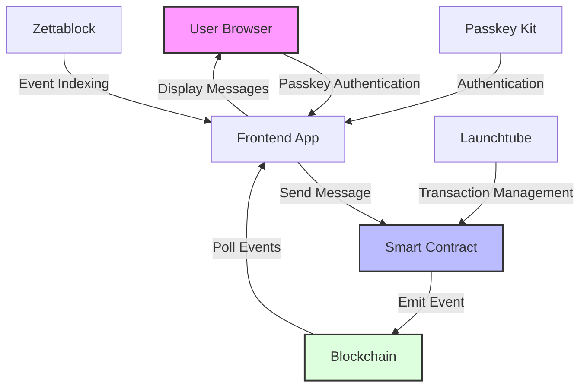

# Project Overview

The Stellar Network Chat Demo is a decentralized application (dApp) that demonstrates how to build a secure, user-friendly communication platform on the Stellar blockchain. It leverages Soroban smart contracts, passkey authentication, and event indexing to create a seamless chat experience.

## High-Level Overview

## Key Components

### Smart Contract (Soroban)

The core of the application is a simple but powerful smart contract written using the Soroban SDK for the Stellar blockchain. The contract:

- Accepts messages from authenticated users
- Validates the sender's identity using `require_auth()`
- Emits events containing the message content
- Stores no state, making it efficient and cost-effective

### Frontend (Astro + Svelte)

The user interface is built with Astro and Svelte, providing a reactive and performant experience. It:

- Handles user authentication using PasskeyKit
- Displays chat messages in a familiar interface
- Polls the blockchain for new messages
- Manages transaction signing and submission

### Authentication (PasskeyKit)

Authentication is handled by PasskeyKit, which leverages WebAuthn standards to provide:

- Passwordless login
- Biometric authentication (fingerprint, face ID)
- Transaction signing
- Fine-grained authorization

### Transaction Management (Launchtube)

Launchtube handles the complexities of transaction submission, including:

- Fee calculation and management
- Transaction simulation
- Error handling and retries
- Network communication

### Event Indexing (Zettablock)

Zettablock is used to index and query events emitted by the smart contract, providing:

- Efficient message retrieval
- Historical message access
- Structured data querying

## User Flow

1. User authenticates with PasskeyKit
2. User types a message and submits it
3. Message is signed using the user's passkey
4. Transaction is sent to the smart contract via Launchtube
5. Smart contract emits an event containing the message
6. Frontend polls for new events
7. New messages are displayed in the chat interface

## Demo Use Cases

- **Web3 Onboarding**: Demonstrates how to create a user-friendly onboarding flow using passkeys
- **Smart Contract Events**: Shows how to use events for data storage and retrieval
- **Transaction Management**: Illustrates best practices for handling blockchain transactions
- **Biometric Authentication**: Showcases secure, passwordless authentication for Web3 applications 