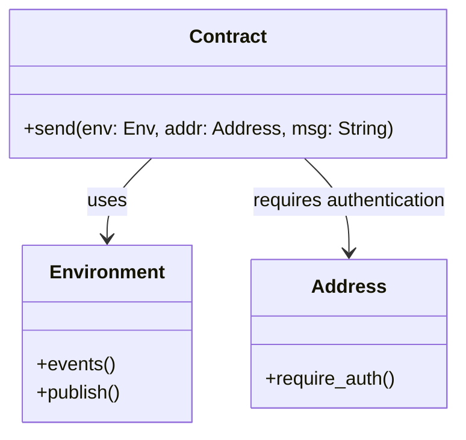
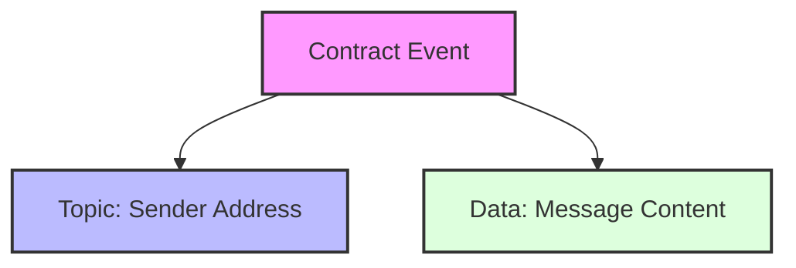
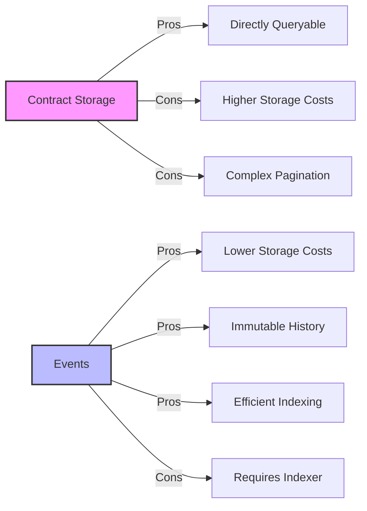

# Smart Contract

The Stellar Chat Demo uses a Soroban smart contract to handle message broadcasting and authentication. This document provides a detailed explanation of the smart contract's design, implementation, and usage.

## Contract Overview



The smart contract is intentionally simple, focusing on a single core function: broadcasting messages as events on the Stellar blockchain.

## Contract Code

Located at `contracts/chat-demo/src/lib.rs`:

```rust
#![no_std]
use soroban_sdk::{contract, contractimpl, Address, Env, String};

#[contract]
pub struct Contract;

#[contractimpl]
impl Contract {
    pub fn send(env: Env, addr: Address, msg: String) {
        addr.require_auth();

        env.events().publish((addr.clone(),), msg.clone());
    }
}

mod test;
```

## Key Components

### `send` Function

The `send` function is the core of the contract:

```rust
pub fn send(env: Env, addr: Address, msg: String) {
    addr.require_auth();

    env.events().publish((addr.clone(),), msg.clone());
}
```

It takes three parameters:
- `env`: The Soroban environment
- `addr`: The address of the sender
- `msg`: The message content

### Authentication

```rust
addr.require_auth();
```

This line ensures that the transaction is authorized by the sender. This is a critical security feature that:
- Verifies the transaction has a valid signature from the sender
- Prevents message spoofing
- Ensures sender identity

### Event Publishing

```rust
env.events().publish((addr.clone(),), msg.clone());
```

This line publishes an event with:
- A topic containing the sender's address
- A data payload containing the message content

The event structure allows for efficient indexing and querying of messages by sender.

## Event Structure

When the contract publishes an event, it creates a structure like this:



In XDR format, this might look like:

```
AAAAAQAAAAAAAAABaMckBAPXCgrVQzx0n7dV7dc/4o1c7DE4lPPjFG0H9O0AAAABAAAAAAAAAAEAAAASAAAAAAAAAADElgmYaPOi19RkiYiykhX7tQjaBZ4Sw1wgNFLgIiDYUQAAAA4AAAAQdGVzdC1tc2ctdG8tc2VuZA==
```

When decoded to JSON:

```json
{
  "in_successful_contract_call": true,
  "event": {
    "ext": "v0",
    "contract_id": "68c7240403d70a0ad5433c749fb755edd73fe28d5cec313894f3e3146d07f4ed",
    "type_": "contract",
    "body": {
      "v0": {
        "topics": [
          {
            "address": "GDCJMCMYNDZ2FV6UMSEYRMUSCX53KCG2AWPBFQ24EA2FFYBCEDMFCBCV"
          }
        ],
        "data": {
          "string": "test-msg-to-send"
        }
      }
    }
  }
}
```

## Contract Deployment

The contract is deployed to the Stellar network using the Stellar CLI:

```bash
stellar contract build
stellar contract deploy \
    --wasm target/wasm32-unknown-unknown/release/chat_demo.wasm \
    --source alice \
    --network testnet
```

## Contract Invocation

Once deployed, the contract can be invoked using the Stellar CLI:

```bash
stellar contract invoke \
    --id CBUMOJAEAPLQUCWVIM6HJH5XKXW5OP7CRVOOYMJYSTZ6GFDNA72O2QW6 \
    --source alice2 \
    -- \
    send \
    --addr GDCJMCMYNDZ2FV6UMSEYRMUSCX53KCG2AWPBFQ24EA2FFYBCEDMFCBCV \
    --msg new-mesg-test2
```

Or programmatically using the generated TypeScript bindings:

```typescript
let at = await chat.send({
    addr: $contractId,
    msg,
});
at = await account.sign(at, {keyId: $keyId});

await server.send(at);
```

## Design Considerations

### Why Use Events?



We chose to use events rather than contract storage because:
1. **Efficiency**: Events use fewer resources than contract storage
2. **Simplicity**: The contract remains simple and focused
3. **Scalability**: Event indexing can handle large volumes of messages
4. **Cost**: Lower transaction costs for users

### Security Considerations

The contract implements these security measures:
- Authentication using `require_auth()`
- No mutable state, reducing attack surface
- Clear separation of concerns
- Minimal code footprint

### Limitations

The current implementation has some limitations:
- No message editing or deletion
- No direct querying of messages within the contract
- No built-in filtering or moderation
- Requires an indexer for efficient message retrieval

## Testing

The contract includes tests to verify its functionality. These tests ensure that:

- Authentication is properly enforced
- Events are published correctly
- The contract handles edge cases

```rust
mod test {
    // Test code here
}
```

## Future Enhancements

Potential improvements to the contract:
- Message editing and deletion
- Message threading
- Read receipts
- User profiles and metadata
- Moderation features 