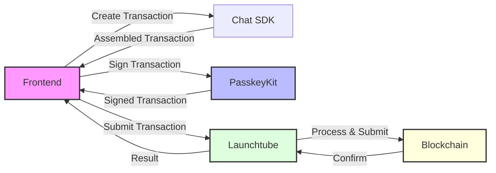
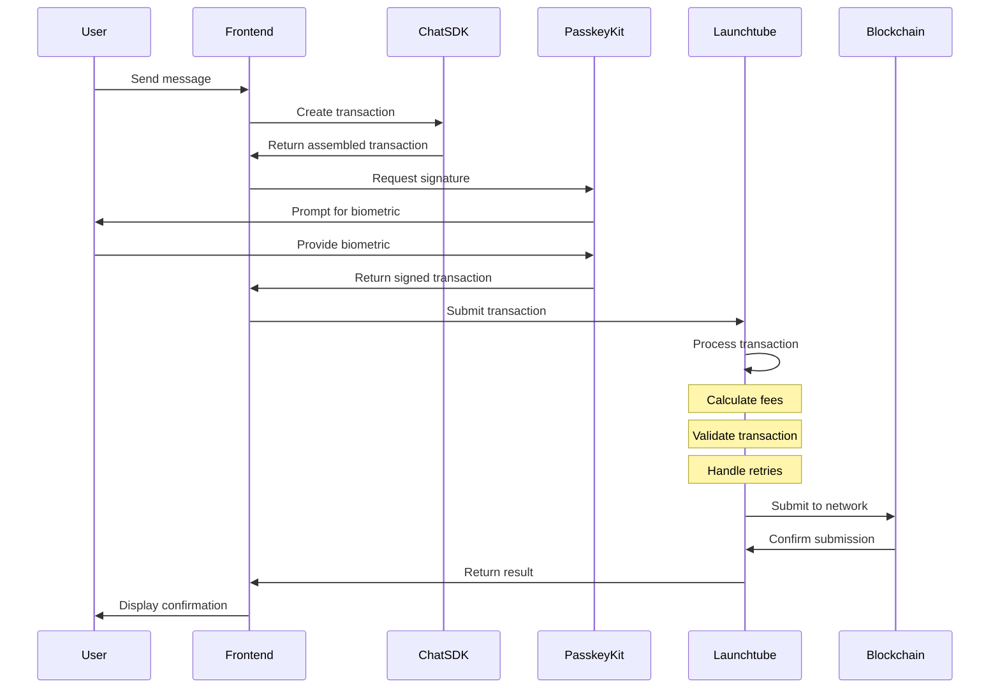
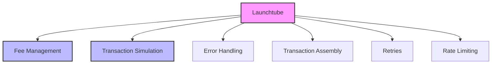
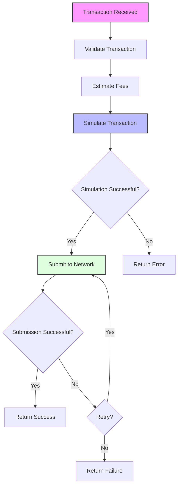
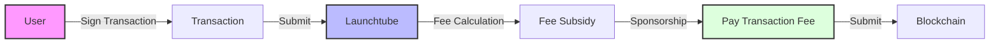

# Transaction Flow

This document details how transactions are created, signed, and submitted to the Stellar blockchain in the Chat Demo application.

## Overview



## Transaction Lifecycle



## Transaction Creation

The first step in the process is creating a transaction using the generated TypeScript bindings from the Stellar CLI:

```typescript
// src/components/Welcome.svelte
let at = await chat.send({
    addr: $contractId,
    msg,
});
```

This produces an `AssembledTransaction` object that contains:
- The operation to be performed (`send`)
- The parameters for the operation (`addr` and `msg`)
- The contract ID to interact with

## Transaction Signing

Once the transaction is assembled, it needs to be signed using PasskeyKit:

```typescript
// src/components/Welcome.svelte
at = await account.sign(at, { keyId: $keyId });
```

This:
1. Requests a signature from the user's passkey
2. Prompts the user for biometric authentication
3. Signs the transaction with the user's private key
4. Returns the signed transaction

## Transaction Submission with Launchtube

After signing, the transaction is submitted to the Stellar network via Launchtube:

```typescript
// src/components/Welcome.svelte
await server.send(at);
```

### What is Launchtube?

Launchtube is a service that abstracts away the complexity of submitting transactions to the Stellar network. It handles:



### Launchtube Configuration

The application configures Launchtube in the `passkey-kit.ts` file:

```typescript
// src/utils/passkey-kit.ts
export const server = new PasskeyServer({
    rpcUrl: import.meta.env.PUBLIC_RPC_URL,
    launchtubeUrl: import.meta.env.PUBLIC_LAUNCHTUBE_URL,
    launchtubeJwt: import.meta.env.PUBLIC_LAUNCHTUBE_JWT,
});
```

This creates a `PasskeyServer` instance that:
- Connects to the Stellar RPC server
- Connects to the Launchtube service
- Authenticates with the Launchtube JWT

### Transaction Processing

When Launchtube receives a transaction, it performs several steps:



1. **Validation**: Checks that the transaction is well-formed
2. **Fee Estimation**: Calculates the appropriate fee for the transaction
3. **Simulation**: Simulates the transaction to check for errors
4. **Submission**: Submits the transaction to the Stellar network
5. **Retries**: Handles retries in case of temporary failures
6. **Result**: Returns the result to the client

### Paymaster Functionality

One key feature of Launchtube is its paymaster functionality, which subsidizes transaction fees:



This means users don't need to worry about obtaining the native Stellar token to pay for transaction fees, making the application more user-friendly.

## Transaction Error Handling

The transaction flow includes error handling at multiple levels:

```typescript
// src/components/Welcome.svelte
async function send() {
    if (!$contractId || !$keyId) return;

    try {
        sending = true;

        let at = await chat.send({
            addr: $contractId,
            msg,
        });

        at = await account.sign(at, { keyId: $keyId });

        await server.send(at);

        msg = "";
    } finally {
        sending = false;
    }
}
```

Potential errors that could occur include:
- Contract creation errors
- Signing errors (user cancels, device error)
- Network errors
- Transaction validation errors
- Blockchain errors

## Transaction Status UI

The UI reflects the transaction status to provide feedback to the user:

```html
<!-- src/components/Welcome.svelte -->
<button
    class="bg-black text-white px-2 py-1 text-sm font-mono disabled:bg-gray-400"
    type="submit"
    disabled={sending}>Send{sending ? "ing..." : ""}</button>
```

This shows:
- Normal state: "Send"
- Processing state: "Sending..." (and the button is disabled)

## Technical Details

### XDR Formatting

Transactions on Stellar are formatted using XDR (External Data Representation):

```
AAAAAQAAAAAAAAABaMckBAPXCgrVQzx0n7dV7dc/4o1c7DE4lPPjFG0H9O0AAAABAAAAAAAAAAEAAAASAAAAAAAAAADElgmYaPOi19RkiYiykhX7tQjaBZ4Sw1wgNFLgIiDYUQAAAA4AAAAQdGVzdC1tc2ctdG8tc2VuZA==
```

The SDK and Launchtube handle the conversion between JavaScript objects and XDR.

### Resource Fees

Stellar charges resource fees for transactions based on:
- Network usage
- CPU usage
- Memory usage
- Storage usage

Launchtube calculates and covers these fees.

### Transaction Footprint

Each transaction has a "footprint" that defines the ledger entries it will read or write:

```
{
  "readOnly": [
    "Contract:CBUMOJAEAPLQUCWVIM6HJH5XKXW5OP7CRVOOYMJYSTZ6GFDNA72O2QW6"
  ],
  "readWrite": []
}
```

Launchtube calculates this footprint during transaction assembly.

## Benefits of Launchtube

Using Launchtube provides several advantages:

1. **Simplified Development**: Abstracts away transaction complexity
2. **Better UX**: Users don't need to worry about fees
3. **Reliability**: Handles retries and error scenarios
4. **Rate Limit Management**: Works around network rate limits
5. **Fee Optimization**: Calculates appropriate fees

## Future Enhancements

Potential improvements to the transaction flow:

- **Transaction Status Updates**: Provide more detailed status information
- **Transaction History**: Store and display a history of past transactions
- **Batch Transactions**: Support for sending multiple messages in one transaction
- **Transaction Analysis**: Analyze transactions for potential security risks
- **Custom Fee Logic**: More sophisticated fee management for different user tiers 